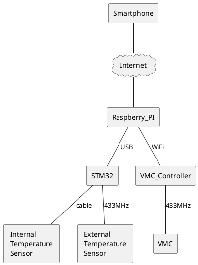

*Last update on 25/04/2020*

# Data Server on Raspberry PI

## Smart Home Installation

I will decribe on this page a simple Smart Home Installation which I have build for my home. 

The installation is not limited on described modules and can be adapted for all particular uses.

## Demonstration

## Source Code 

Source code of this project: 

- [https://github.com/tuppi-ovh/data-server-stm32](https://github.com/tuppi-ovh/data-server-stm32)

- [https://github.com/tuppi-ovh/data-server-pi](https://github.com/tuppi-ovh/data-server-pi)

